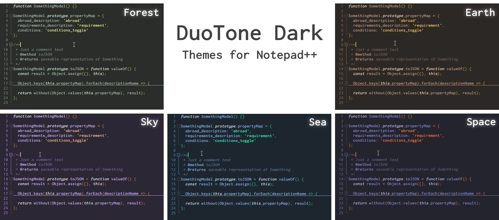

<p align="center"></p>
<p align="center">
  <a href="https://github.com/webketje/notepad-plus-plus-duotone-dark-theme/releases/latest">
    
  </a>
</p>
<p align="center">5 clean, duotone <a href="https://notepad-plus-plus.org">Notepad++</a> themes.</p>
<p align="center">Adapted from <a href="https://github.com/sallar/vscode-duotone-dark">VSCode DuoTone Dark</a> color schemes.</p>

---



## Install

Download the latest 7zip or zip release from [Releases](https://github.com/webketje/notepad-plus-plus-duotone-dark-theme/releases/latest) and extract it to your Notepad++ themes directory.
You can also extract the themes somewhere else, start Notepad++ and import them through the <kbd>Settings</kbd> menu, <kbd>Import > Import style theme(s)...</kbd>.


Alternatively, you can install with command-line by doing (requires Node & NPM):

```batch
git clone https://github.com/webketje/notepad-plus-plus-duotone-dark-theme.git
cd notepad-plus-plus-duotone-dark-theme
npm install
set "NPP_PATH=C:\Path\to\Notepad++"
npm run test
```

## Support

### Languages

Currently supported: C, C#, C++, Objective-C, HTML, XML, YML, PHP, Java, Javascript, Typescript, VueJS, JSON, CSS, SASS, SCSS, SQL, Python, Makefile, bash, batch, LaTeX, R, Powershell, Ruby, diff

### User-defined languages

In 5 themes: markdown (better), Dockerfile

### Config files

Currently supported: .env, .ini, .prettierrc, .eslintrc, .gitmodules, .gitattributes

## Development

You need [NodeJS](https://nodejs.org). Clone the repo, run `npm install`, tweak `theme.xml`, then run `npm run build`. `npm run zip` will also create a ZIP & 7Zip archive in the `/dist` folder, however you will need to install 7-Zip first.

### Contribution

Please report issues/bugs, feature requests and suggestions for improvements to the [issue tracker](https://github.com/webketje/notepad-plus-plus-duotone-dark-theme/issues).

<p align="center">Copyright &copy; 2019 webketje</p>

<p align="center">
  <a href="https://github.com/webketje/notepad-plus-plus-duotone-dark-theme/LICENSE">
    
  </a>
</p>
